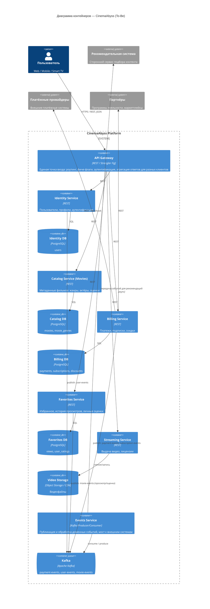

# To-Be архитектура «КиноБездны» — диаграмма контейнеров (C4)

## Доменная декомпозиция

Монолит разбит на домены по границам ответственности (bounded contexts). Критерий разделения —
данные, которыми владеет домен, и скорость изменения бизнес-логики:

| Домен | Сущности (из текущей БД монолита) | Почему отдельный домен |
|---|---|---|
| **Identity** (Users) | users | Аутентификация и профиль меняются независимо от каталога и платежей; нужен для любого клиента (web/mobile/SmartTV) |
| **Catalog** (Movies) | movies, movie_genres | Уже выделен командой (см. `src/microservices/movies`); метаданные фильмов меняются часто (новые релизы, правки жанров/оценок), не связаны транзакционно с деньгами |
| **Billing** | payments, subscriptions, discounts | Платежи, подписки и скидки объединены в один домен — они транзакционно согласованы (оплата → продление подписки → применение скидки) и имеют общие внешние интеграции (платёжные провайдеры, программы лояльности, маркетплейсы) |
| **Favorites / Personalization** | views, user_ratings, избранное | Пользовательский контент (история просмотров, личные оценки, папка «избранное») — высокая нагрузка на запись, не должен тормозить каталог |
| **Streaming** | video (метаданные воспроизведения, лицензии) | Отдаёт сам видеопоток/лицензии, нагрузочный профиль и масштабирование отличаются от остальных доменов (CDN, объектное хранилище) |
| **Events** (кросс-доменный) | — | Шина асинхронных доменных событий (Kafka) для развязки доменов: Billing → Favorites/Recommendations, Identity → Recommendations и т.д. |

Внешние системы остаются внешними: **рекомендательная система** (сторонняя, работает асинхронно),
**платёжные провайдеры**, **партнёры лояльности и маркетплейсы**.

## Единая точка входа

Все клиенты (web, mobile, Smart TV) обращаются только к **API Gateway** (сервис `proxy`,
см. Задание 2). Gateway:

- маршрутизирует запросы в нужный домен по пути (`/api/movies` → Catalog, `/api/payments` → Billing и т.д.);
- на переходный период реализует паттерн **Strangler Fig** — переключает процент трафика между
  монолитом и выделенным микросервисом по фиче-флагу (`GRADUAL_MIGRATION`,
  `MOVIES_MIGRATION_PERCENT`);
- в целевом состоянии (To-Be) все домены уже вынесены в отдельные сервисы, и Gateway становится
  обычным API Gateway / BFF-слоем — единой точкой аутентификации, рейт-лимитинга и агрегации
  ответов для разных типов клиентов (разный объём данных для mobile/SmartTV).

## Синхронное и асинхронное взаимодействие

- **Синхронно (REST/JSON)** — запросы клиента через Gateway к доменным сервисам: получить каталог,
  оформить подписку, добавить в избранное и т.п. Требуют немедленного ответа.
- **Асинхронно (Kafka)** — события между доменами, где немедленный ответ не нужен и важна
  развязка: `payment-events`, `subscription-events`, `user-events`, `movie-events`
  (просмотр/оценка). Эти события читает сервис **Events** и отдаёт дальше во внешнюю
  рекомендательную систему, в аналитику и в домен Favorites (например, обновление истории
  просмотров без синхронного вызова из Billing).
- Каждый домен владеет своей базой данных (Database-per-Service) — это целевое состояние;
  переход от общей БД монолита происходит поэтапно вместе со Strangler Fig (см. `README-правка.md`
  и план миграции).

## Диаграмма контейнеров (C4, нотация Mermaid)

## Траектория перехода (Strangler Fig)

1. Уже сделано: домен Catalog вынесен в `movies-service`, Gateway (`proxy-service`) умеет
   постепенно переключать трафик по `MOVIES_MIGRATION_PERCENT`.
2. Далее по очереди (от простого к сложному, по убыванию связности с остальным монолитом):
   Favorites → Identity → Billing. Billing выносится последним, так как самый критичный к
   консистентности (деньги) и имеет больше всего внешних интеграций.
3. Events/Kafka вводится сразу MVP-версией (Задание 2), чтобы новые домены сразу писали события,
   а не синхронные вызовы друг в друга — это снижает связность на каждом следующем шаге выноса.
4. Монолит продолжает отвечать за домены, которые ещё не вынесены; Gateway прозрачно
   маршрутизирует туда трафик, пока процент миграции домена не станет 100%.
